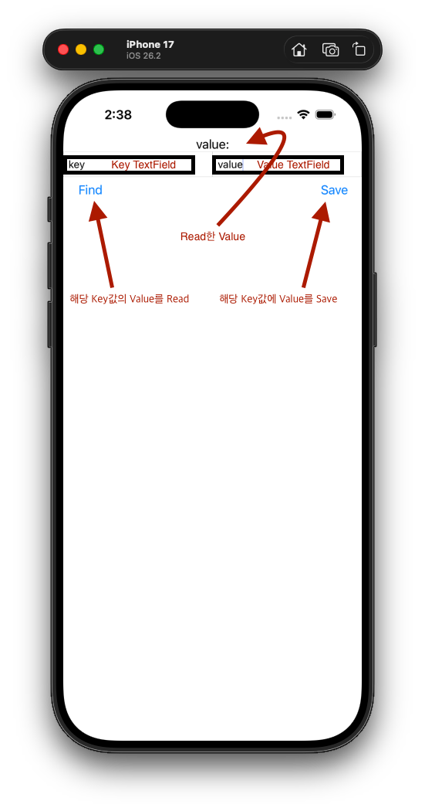

# 🔐 KeychainTestProject

iOS Keychain API를 활용하여  
**데이터 저장 / 조회 / 수정 / 삭제(CRUD)** 를 구현한 테스트 프로젝트입니다.

Keychain으로 민감한 정보를 안전하게 저장하는 방법 및 조회 등을 테스트 해보며
발생한 에러와 해결방법들을 간단하게 작성해보았습니다.

---

## 📌 주요 기능

- Generic Password 기반 Keychain 데이터 저장
- Keychain 데이터 조회
- Keychain 데이터 수정
- Keychain 데이터 삭제
- Keychain 데이터 업데이트
- OSStatus 에러 코드별 해결방법

---

## 🧩 Keychain 구조

본 프로젝트에서는 아래 조합으로 Keychain Item을 식별합니다.

| 항목 | 사용 값 |
|---|---|
| Class | `kSecClassGenericPassword` |
| Account | 사용자 입력 key |
| Service | `Bundle.main.bundleIdentifier` |
| Value | UTF-8 인코딩된 Data |

> ⚠️ Keychain은 **모든 조건이 정확히 일치해야 조회 가능**합니다.

---

## 🖥️ 화면 설명

---
